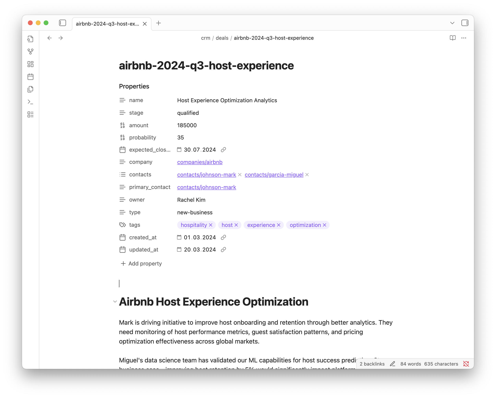

# CCRM

A CRM that uses Markdown files with YAML front matter to represent all entities, making it version-controllable, human-readable, and AI-friendly.

> We don't use a CRM anymore. Claude Code runs our CRM.

by [@dexhorthy](https://github.com/dexhorthy). [See Claude for non-code tasks: 🦄 #20
](https://youtu.be/NJcph4j9sNg?si=YBWvuohIFaRvAnJl&t=662). 


## Design Principles

- **Markdown-first datastore**: No database queries needed - AI tools can read files directly
- **YAML front matter**: Structured, deterministic data for reliable parsing
- **Markdown body**: Free-form notes and context with wikilinks
- **Important context first**: Key information at the top since tools like Claude Code prioritize first 100 lines
- **Simple knowledge graph**: Wikilinks create references between entities
- **Process instructions in CLAUDE.md**: Clear guidance for AI interactions
- **Semantic context packing**: Filter by timestamps, priorities and tags to reduce noise
- **Tools**: Deterministic tools like python scripts for editing

## Getting Started

Prerequisites: `uv` and `pnpn` to install further dependencies and run scripts.

The project contains synthetic sample data under `./crm` so its easy to give it a try:

```sh
git clone git@github.com:luebken/ccrm.git
cd ccrm

claude .
/plugin marketplace add anthropics/skills
/plugin install document-skills@anthropic-agent-skills

/plugin marketplace add luebken/claude-plugins
/plugin install validate-md@luebken-claude-plugins
# retart Claude to load plugins
claude .
```

Some examples commands:
```sh
> Im Sarah Chen. Which deals require my attention?

> Create a PDF report of the latest deals.

> /validate-md
```


## Entity Structure

The system manages four core entities under `/crm/`:
- **Contacts**: Individual people (`/contacts/`)
- **Companies**: Organizations (`/companies/`)  
- **Deals**: Revenue opportunities (`/deals/`)
- **Activities**: Interactions and touchpoints (`/activities/`)

All relationships use wikilinks (e.g., `[[companies/acme-corp]]`) for easy navigation and AI understanding.

## Tools & Workflow

Users can freely edit the raw Markdown and use agent tools which work nicely with Markdown files. These agent tools require instructions. We have created an instruction file for [Claude Code](https://www.anthropic.com/claude-code): [CLAUDE.md](CLAUDE.md).

With Claude you can trigger commands. The `/validate-md` command validates markdown files with YAML frontmatter against JSON Schema definitions to ensure data consistency and format compliance. This is provided by the [validate-md skill](https://github.com/luebken/claude-plugins).

### Obsidian

The Markdown/front matter integration works nicely with Markdown-based tools like [Obsidian](https://obsidian.md/).




## Development

The default `CLAUDE.md` is for working with this project as a CRM. For development there is `DEV.md`. Since Claude Code currently reads `CLAUDE.md` by default you need to switch manually:

```bash
mv CLAUDE.md CLAUDE.md.orig
mv DEV.md CLAUDE.md
claude .
```

## TODO

- [ ] Add AI entity summaries at file beginning
- [ ] Add deterministic context packing example
  - [ ] First 100 lines priority
  - [ ] Tag-based filtering
- [ ] Show Deeper Obsidian integration
- [ ] Add [llm](https://llm.datasette.io/en/stable/) to the AI tooling support